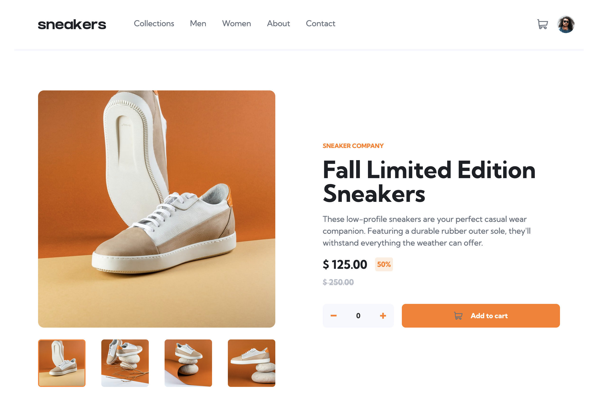
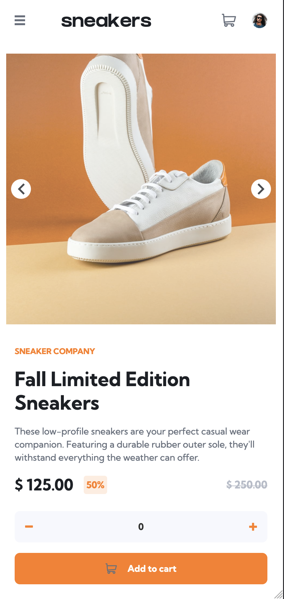

# Frontend Mentor - E-commerce product page solution

This is a solution to the [E-commerce product page challenge on Frontend Mentor](https://www.frontendmentor.io/challenges/ecommerce-product-page-UPsZ9MJp6). Frontend Mentor challenges help you improve your coding skills by building realistic projects.

## Table of contents

- [Overview](#overview)
  - [The challenge](#the-challenge)
  - [Screenshot](#screenshot)
  - [Links](#links)
- [My process](#my-process)
  - [Built with](#built-with)
  - [What I learned](#what-i-learned)
- [Author](#author)

## Overview

### The challenge

Users should be able to:

- View the optimal layout for the site depending on their device's screen size
- See hover states for all interactive elements on the page
- Open a lightbox gallery by clicking on the large product image
- Switch the large product image by clicking on the small thumbnail images
- Add items to the cart
- View the cart and remove items from it

### Screenshot

### Links

- Solution : [URL](https://github.com/DnzzL/ecommerce)
- Live Site URL: [URL](https://dnzzl.github.com/ecommerce)

## My process

### Built with

- Flexbox
- CSS Grid
- Mobile-first workflow
- [React](https://reactjs.org/) - JS library
- [Tailwind CSS](https://tailwindcss.com/) and [daisyUI](https://daisyui.com/) - For styles

### What I learned

I focused on the mobile-first workflow so much that I didn't anticipated enough the desktop version.

I liked the ease of use of Tailwind but I disliked how messy it can become with media queries or when the desktop layout is very different from the mobile one.

## Author

- Website - [Thomas Legrand](https://thomas.legrand.sh)
- Frontend Mentor - [@dnzzl](https://www.frontendmentor.io/profile/dnzzl)
- Twitter - [@thomasd_legrand](https://www.twitter.com/thomasd_legrand)
